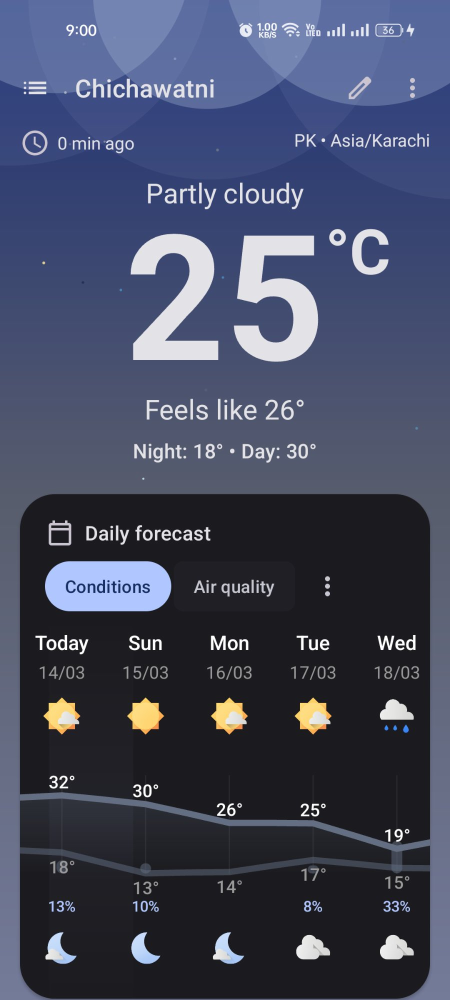
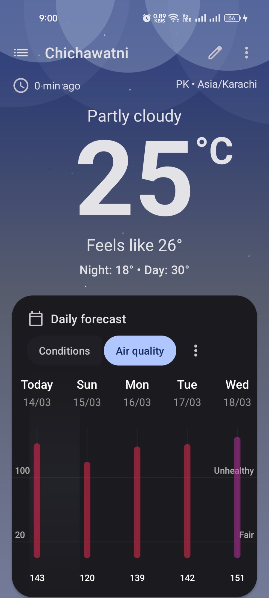
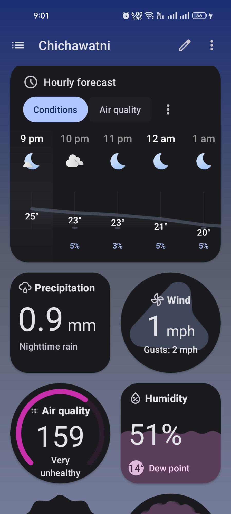
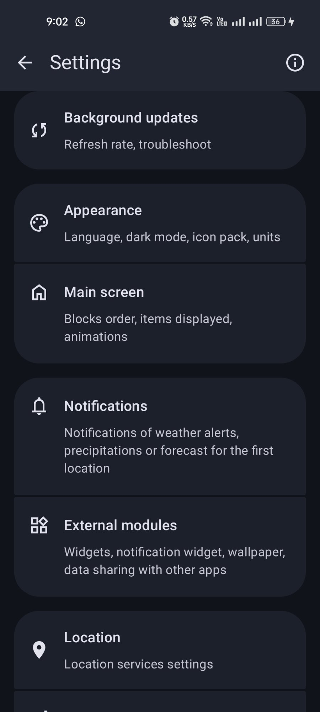

<div align="center">

# 🌤️ Weather Forecast Android

**A beautiful and comprehensive weather forecast application for Android**


</div>

---

## 📖 Overview

**Weather Forecast Android** is a modern, feature-packed weather application that delivers real-time weather data right to your fingertips. With a stunning dark-themed UI, it provides current conditions, hourly and daily forecasts, air quality index, precipitation, wind speed, humidity, and much more — all with rich visualizations and deep customization options.

---

## 📸 Screenshots

<div align="center">

| Current Weather | Daily Forecast | Hourly Forecast | Settings |
|:--------------:|:--------------:|:---------------:|:--------:|
|  |  |  |  |

</div>

---

## ✨ Features

### 🌡️ Current Weather
- **Real-time conditions** — Live temperature, feels-like, and weather description
- **Day/Night range** — Shows the day's high and low temperatures
- **Location & Timezone** — Displays country code and timezone (e.g. PK • Asia/Karachi)
- **Last updated indicator** — Shows how recently data was refreshed

### 🕐 Hourly Forecast
- **Hour-by-hour breakdown** — Weather icons and temperatures for each hour
- **Precipitation probability** — Chance of rain per hour
- **Conditions & Air Quality toggle** — Switch between weather conditions and AQI per hour

### 📅 Daily Forecast
- **Multi-day outlook** — Forecast cards for Today through the coming week
- **High/Low temperatures** — Visual temperature range graph per day
- **Precipitation %** — Daily rain probability
- **Day & night icons** — Separate icons for daytime and nighttime conditions
- **Air Quality chart** — Bar chart showing AQI values per day with quality labels (Fair / Unhealthy)

### 💨 Weather Detail Cards
- **Precipitation** — Amount in mm with description (e.g. Nighttime rain)
- **Wind** — Speed in mph + gust speed
- **Air Quality Index** — Circular AQI gauge with health label (e.g. Very Unhealthy: 159)
- **Humidity** — Percentage with dew point temperature

### ⚙️ Settings
- **Background Updates** — Configure refresh rate and troubleshoot sync
- **Appearance** — Language, dark mode, icon pack, and units
- **Main Screen** — Customize block order, items displayed, and animations
- **Notifications** — Weather alerts, precipitation, and forecast notifications
- **External Modules** — Widgets, notification widget, wallpaper, data sharing
- **Location** — Location services configuration

---

## 🛠️ Tech Stack

### Languages

| Language | Role |
|----------|------|
| **Kotlin** | Primary language — modern Android logic, coroutines, extensions |
| **Java** | Supporting components and legacy Android APIs |

### Android & Jetpack

| Component | Purpose |
|-----------|---------|
| **Android SDK** | Core platform APIs |
| **Retrofit / OkHttp** | Network requests to weather APIs |
| **Room Database** | Local caching of weather data |
| **ViewModel + LiveData** | Lifecycle-aware data management |
| **WorkManager** | Background weather data refresh |
| **Coroutines** | Asynchronous API calls |
| **RecyclerView** | Hourly and daily forecast lists |
| **MPAndroidChart / Canvas** | Temperature range graphs and AQI bar charts |
| **Material Design 3** | Dark theme UI components |
| **Location Services** | GPS-based automatic location detection |
| **Notification API** | Weather alerts and forecast notifications |
| **Widgets API** | Home screen and lock screen weather widgets |

### Build Tools

| Tool | Purpose |
|------|---------|
| **Gradle (Kotlin DSL)** | Build automation |
| **Android Studio** | Official IDE |
| **Gradle Wrapper** | Consistent build environment |

---

## 🏗️ Architecture

This project follows **MVVM Clean Architecture**:

```
┌──────────────────────────────────────────────┐
│                  UI Layer                     │
│     Activities / Fragments / Widgets / XML    │
└──────────────────┬───────────────────────────┘
                   │ observes
┌──────────────────▼───────────────────────────┐
│              ViewModel Layer                  │
│      Business logic & UI state management     │
└──────────────────┬───────────────────────────┘
                   │
┌──────────────────▼───────────────────────────┐
│             Repository Layer                  │
│     Coordinates remote API + local cache      │
└────────┬─────────────────────────┬───────────┘
         │                         │
┌────────▼────────┐     ┌──────────▼──────────┐
│  Remote Source  │     │    Local Source      │
│  (Weather API   │     │  (Room Database)     │
│   via Retrofit) │     │                      │
└─────────────────┘     └─────────────────────┘
```

---

## 📁 Project Structure

```
weather-forecast-android/
├── app/
│   └── src/
│       └── main/
│           ├── java/
│           │   ├── ui/            # Activities, Fragments, Adapters
│           │   ├── viewmodel/     # ViewModels
│           │   ├── repository/    # Data repositories
│           │   ├── network/       # Retrofit API service & models
│           │   ├── database/      # Room DB entities & DAOs
│           │   ├── worker/        # WorkManager background tasks
│           │   └── util/          # Extensions & helpers
│           └── res/
│               ├── layout/        # XML layouts
│               ├── drawable/      # Icons & graphics
│               └── values/        # Colors, strings, themes
├── gradle/
├── build.gradle.kts
├── settings.gradle.kts
└── gradle.properties
```

---

## 🚀 Getting Started

### Prerequisites

- Android Studio **Hedgehog** or later
- Android SDK **21+**
- JDK **11** or higher
- A weather API key (e.g. OpenWeatherMap, Open-Meteo, or similar)

### Installation

1. **Clone the repository**
   ```bash
   git clone https://github.com/informatikasertifikasiya1-stack/weather-forecast-android.git
   ```

2. **Open in Android Studio**
   - Launch Android Studio → **File → Open** → select the cloned folder

3. **Add your API key**
   - Open `local.properties` (or the relevant config file) and add:
   ```
   WEATHER_API_KEY=your_api_key_here
   ```

4. **Sync Gradle & Run**
   - Let Gradle sync dependencies
   - Connect a device or start an emulator
   - Press **▶ Run** or `Shift + F10`

---

## 🤝 Contributing

Contributions, issues, and feature requests are welcome!

1. Fork the project
2. Create your feature branch: `git checkout -b feature/AmazingFeature`
3. Commit your changes: `git commit -m 'Add some AmazingFeature'`
4. Push to the branch: `git push origin feature/AmazingFeature`
5. Open a Pull Request

---

## 📄 License

This project is open source and available under the [MIT License](LICENSE).

---

<div align="center">

Made with ❤️ by [informatikasertifikasiya1-stack](https://github.com/informatikasertifikasiya1-stack)

⭐ Star this repo if you found it helpful!

</div>
